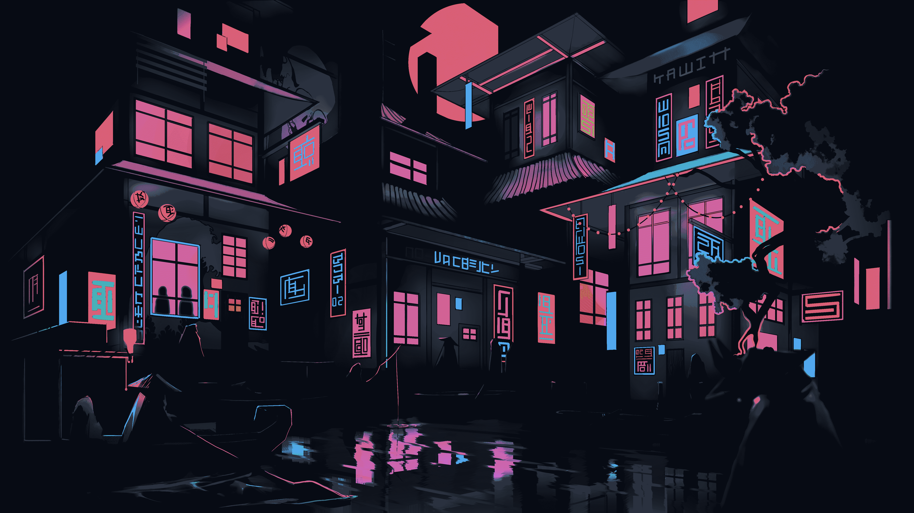
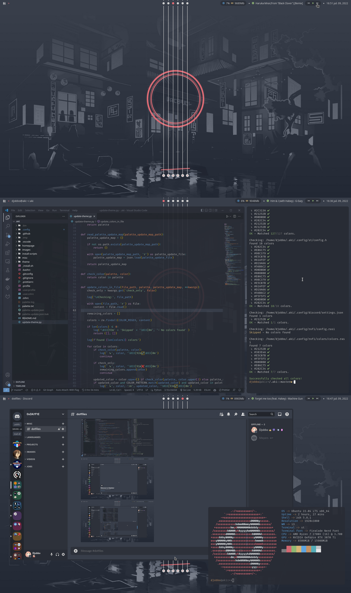

# 🗒️ Aki dotfiles
> These are my personal dotfiles, made specifically for my setup. You can use/modify them freely. but you might need to make some modifications to suit your installation.

## System Info

- OS: Ubuntu 22.04 LTS
- WM: [i3-gaps (Airblader Fork)](https://github.com/Airblader/i3)
- Terminal: [kitty](https://github.com/kovidgoyal/kitty)
- Shell: zsh + [Oh My Zsh](https://github.com/ohmyzsh/ohmyzsh)
    > add a `.user.zshrc` file next to `.zshrc` to add user specific config to zsh
- Bar: [eww](https://github.com/elkowar/eww)
- Launcher: [Rofi](https://github.com/davatorium/rofi)
- Browser: Firefox
- Font: [FiraCode Nerd Font](https://github.com/ryanoasis/nerd-fonts)
- Compositor: [Picom (Jonaburg fork)](https://github.com/jonaburg/picom)
- Colorscheme: One Dark [Bimbo] ([VSCode Theme](https://marketplace.visualstudio.com/items?itemName=marioterron.one-dark-bimbo))
- Wallpaper: Custom made by me  
    
    

    
Based on this wallpaper from <a href="https://wallpaperaccess.com/neon-shallows">WallpaperAccess</a>

    
    

## Screenshots

